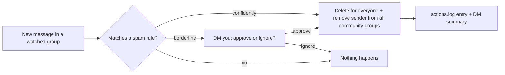

# WhatsApp Spam Guard


> **Automated spam protection for your WhatsApp Community.**
> **It detects spam, deletes it for everyone, and removes the sender — in seconds, from every group at once.**

Rule-based auto-moderation for WhatsApp Communities. The bot watches the groups
you choose, and when a message matches one of your spam rules (investment scams,
job scams — whatever your community actually gets hit with), it **deletes the
message for everyone and removes the sender from every group in the community**,
then reports exactly what it did straight to your DMs.

- 🛡️ **Safe by default** — every rule starts in log-only mode: detect and
  report, never delete or remove, until *you* flip that rule to live.
- 🤝 **You stay in charge** — borderline messages aren't silently dropped or
  nuked; the bot DMs you and waits for your `approve` / `ignore` reply.
- 🌙 **No server required to start** — run it once a day from your laptop; it
  catches up on everything that happened while it was offline.
- 📝 **Rules, not code** — each spam category is a few lines of JSON: keywords,
  a link pattern, thresholds, and its own live/log-only switch. Matching sees
  through lookalike-Unicode and invisible-character tricks spammers use.
- 📱 **Control it from your phone** — text `bot status`, `bot pending`,
  `bot approve 4` to the bot on WhatsApp; no terminal needed day-to-day.
- 🚦 **Circuit breaker** — if a rule suddenly takes too many live actions
  (usually a botched keyword edit, not spam), it's auto-paused and you're
  alerted, so one bad config change can't empty your community.
- 📜 **Full audit trail** — every action (real or simulated) is written to a
  plain-English log and DMed to you.

> [!IMPORTANT]
> This bot is built on [`@whiskeysockets/baileys`](https://github.com/WhiskeySockets/Baileys),
> an **unofficial, reverse-engineered WhatsApp Web client** — **not** the
> official WhatsApp Business API (there is no free official option that supports
> this use case). It logs in as a real WhatsApp account (your admin account) and
> performs the same actions a human admin could do by hand in the app.
> **Read [Risks](#risks) before deploying — it's important, not boilerplate.**

## Contents

- [How it works](#how-it-works)
- [What you need](#what-you-need)
- [Quick start](#quick-start) ← start here
- [Manual setup](#manual-setup)
- [Test in log-only mode first](#test-in-log-only-mode-first)
- [The review workflow](#the-review-workflow)
- [Admin commands (WhatsApp DM)](#admin-commands-whatsapp-dm)
- [Running once a day instead of 24/7](#running-once-a-day-instead-of-247)
- [Going live](#going-live)
- [Deploying to a free VM](#deploying-to-a-free-vm)
- [Managing the bot once it's deployed](#managing-the-bot-once-its-deployed)
- [Logs: what to check and when](#logs-what-to-check-and-when)
- [Configuration reference](#configuration-reference)
- [Adding a new spam category](#adding-a-new-spam-category)
- [Fixing a false positive](#fixing-a-false-positive)
- [Risks](#risks)

## How it works

1. You tell the bot which groups to watch and what spam looks like
   (`config/config.json` — the [Quick start](#quick-start) wizard writes this
   for you).
2. The bot connects to WhatsApp as your account and watches those groups for
   new messages.
3. Each message is checked against every enabled rule. A rule can:
   - **Match confidently** → the message is deleted and the sender is removed
     from every configured group (or just logged/reported, if that rule's
     `actionMode` is `"log-only"`).
   - **Match partially** ("borderline") → instead of ignoring it, the bot DMs
     you asking for a decision. Reply `approve <id>` or `ignore <id>`.
   - **Not match** → ignored.
4. Everything the bot does is written to `logs/actions.log` in plain English,
   and DMed to you as a short summary.



> In log-only mode the delete/remove step is **simulated and reported instead
> of executed** — see [Test in log-only mode first](#test-in-log-only-mode-first).

> [!NOTE]
> The message is deleted immediately, but the sender's removal is deliberately
> delayed by a random 5-15 seconds (see `REMOVAL_JITTER_MIN_MS`/`_MAX_MS` in
> `src/moderation.js`) so the bot doesn't act on a spam message at obviously
> inhuman, sub-second speed. `logs/actions.log` and the DM summary are only
> written once that delay has elapsed, so don't expect them the instant the
> message disappears.

## What you need

- **Node.js 20.11 or newer** (22 LTS recommended) — check with `node -v`,
  install from [nodejs.org](https://nodejs.org) if needed.
- **A WhatsApp account that is an admin of the community** you want to protect.
  The bot acts as this account.
- **Your phone nearby** — you'll scan a QR code once to pair, exactly like
  WhatsApp Web.
- Ideally, **a second WhatsApp account** (a friend's phone works) for sending
  test spam later.

## Quick start

Three commands:

```bash
npm install
npm run setup
npm start
```

`npm run setup` is a guided wizard (~3 minutes) that handles everything:

1. Asks for your WhatsApp number (with country code, digits only — e.g.
   `1XXXXXXXXXX` for US/Canada, `91XXXXXXXXXX` for India) and saves it to `.env`.
2. Shows a **QR code** — on your phone, open WhatsApp → **Settings → Linked
   Devices → Link a device**, and scan it.
3. Lets you pick your community from a menu, and **automatically selects the
   correct community JID** (a genuinely easy thing to get wrong by hand — see
   the warning in [Manual setup](#manual-setup)).
4. Lets you tick which groups to monitor (all selected by default).
5. Sets up a starter **investment-spam** rule in log-only mode (recommended) —
   so nothing gets deleted and nobody gets removed until you've watched it work
   and flipped it live yourself.

Then `npm start` — when you see `🟢 LIVE - watching for spam` in the terminal,
you're running. You'll also get a WhatsApp DM from the bot confirming it's
online (reply `bot help` to it to see what you can ask it).

**Try it out:** from a second account, post something like
`invest in stocks for guaranteed returns https://chat.whatsapp.com/test123`
into a monitored group. Within seconds you should get a DM summary from
yourself, and `logs/actions.log` gets a `LOG-ONLY (simulated)` entry. When
you're happy with what it's catching, see [Going live](#going-live).

The wizard covers the common case: one community, one starter rule. If you want
several rules from day one, only want to protect some of a community's groups
in a non-obvious way, or just want to understand every moving part, use the
manual path below.

## Manual setup

### 1. Install and create your config files

```bash
npm install
cp .env.example .env
# edit .env: set BOT_PHONE_NUMBER to your admin number, INCLUDING country code, no + or spaces (e.g. 1XXXXXXXXXX for US/Canada, 91XXXXXXXXXX for India)
cp config/config.example.json config/config.json
```

`config/config.json` is gitignored on purpose — it will end up holding your real
community/group JIDs and phone number, which you don't want committed to a public
repo. `config/config.example.json` is the template that stays in git.

### 2. Find your group and community JIDs

You need the real WhatsApp JIDs for your groups and community before the bot can
do anything useful. Run:

```bash
npm run list-groups
```

On first run it has no session yet, so it will show a **QR code** in your
terminal — open WhatsApp on your phone, go to **Linked Devices > Link a device**,
and scan it. Once connected, it dumps every group/community you're in to the
terminal and to `logs/groups-dump.json`.

Look for your regular groups (the ones you actually want to monitor) — use
their JIDs as `groupJids`.

> [!WARNING]
> For `communityJid`, use the community's **announcement group** — the entry
> with `isCommunityAnnounce: true` and `linkedParent` pointing at the
> community's own JID — **not** the bare community entity (the one with
> `isCommunity: true` and `isCommunityAnnounce: false`). This matters:
> WhatsApp's own documentation confirms _"all members of a community are part
> of the announcement group"_ — that's the group with a real, removable
> membership list. The bare community JID is just a container/metadata entry;
> calling `groupParticipantsUpdate` on it returns a `bad-request` error instead
> of actually removing anyone. (This is a real mistake made during this
> project's own development — see `AGENTS.md` if you want the full story.)

Edit `config/config.json` and paste in the real JIDs, plus your own admin JID
(`adminJids`, format `<number>@s.whatsapp.net` — `<number>` must include the
country code, same as `BOT_PHONE_NUMBER`, e.g. `91XXXXXXXXXX@s.whatsapp.net`).

### 3. Write your detection rules

`config/config.json` has a `rules` array. Each rule is an independent spam
category with its own keywords and its own `actionMode`, so you can, for example,
keep a well-tested rule live while trying out a brand-new one in log-only mode.

```jsonc
{
  "id": "investment-spam", // short name, shown in logs/DMs
  "enabled": true,
  "actionMode": "log-only", // "log-only" or "live" - see "Test in log-only mode first"
  "requireLink": true, // message must contain a matching link to count at all
  "linkPattern": "chat\\.whatsapp\\.com/",
  "keywords": ["invest", "stocks", "mutual fund", "..."],
  "minKeywordMatches": 1, // distinct keyword hits needed to auto-act
  "reviewKeywordMatches": 1, // hits needed to flag for your review instead of ignoring
}
```

A message only auto-deletes if it satisfies _both_ `requireLink` (when true) and
`minKeywordMatches`. A message with the link but a keyword count between
`reviewKeywordMatches` and `minKeywordMatches` gets flagged for your review
instead of silently dropped — that's the case the heuristic is least sure about
(the link is the rare, high-signal half of the fingerprint; a keyword like
"invest" alone shows up in plenty of normal conversation, which is why
keyword-only matches with no link are ignored entirely rather than reviewed).

Matching is obfuscation-resistant: text is Unicode-normalized first, so
lookalike letters (`𝐢𝐧𝐯𝐞𝐬𝐭`) and invisible zero-width characters spliced into
keywords or links don't evade detection.

See [Adding a new spam category](#adding-a-new-spam-category) for a worked
example of a second rule.

## Test in log-only mode first

Before involving WhatsApp at all, you can dry-run any text through your rules
locally:

```bash
npm run test-message -- "invest in stocks for guaranteed returns https://chat.whatsapp.com/abc"
```

It prints, per rule, whether that exact message would be acted on, flagged for
review, or left alone — and why. Use it to tune keywords and thresholds
instantly instead of posting test messages over and over.

Then test the real flow. Every rule should start with `"actionMode": "log-only"`
— the bot will detect spam, log what it _would_ do, and DM you a summary, but
won't actually delete anything or remove anyone. Run it:

```bash
npm start
```

Post a test message matching a rule's pattern from a second phone/account into
one of your groups and confirm:

- `logs/actions.log` shows a new `LOG-ONLY (simulated)` entry.
- You get a DM to yourself summarizing the (simulated) action.

Also try messages that should **not** trigger it (e.g. just mentioning "invest"
with no link) to confirm no false positives, and a message with the link but a
weak keyword count to see the review-flow DM (`approve`/`ignore`) in action.

## The review workflow

When a rule flags a message as borderline, you'll get a DM like:

```
🤔 Possible spam (needs your review) #4
Rule: investment-spam
Group: 120363...@g.us
Sender: 91XXXXXXXXXX
Reason: [investment-spam] borderline: link=true keywords=invest
Text: "invest now https://chat.whatsapp.com/abc"

Reply "bot approve 4" to delete the message and remove the sender, or "bot ignore 4" to dismiss.
```

Reply in that same chat (it's a message to yourself, since the bot runs as your
own account):

- `bot approve 4` → deletes the message and removes the sender from every
  configured group, exactly like an auto-detected live match, regardless of that
  rule's own `actionMode` (your explicit approval always takes real action).
- `bot ignore 4` → dismissed, nothing happens.

Pending reviews are saved to `logs/pending-review.json`, not just kept in memory —
so if you reply after the bot process has already exited (see the once-a-day
section below), your reply is picked up automatically the next time it connects.
If a review sits unanswered for 12 hours, you get a single reminder DM; reviews
older than 3 days are dropped rather than acted on. `bot pending` lists
everything still waiting on you.

## Admin commands (WhatsApp DM)

The bot listens for commands in your admin chat. **Every command must start
with the word `bot`** — anything else you type there is completely ignored, so
using that chat for personal notes never accidentally triggers the bot.
(Case-insensitive: `Bot status` from an autocapitalizing phone keyboard works.)

| Command               | What it does                                                                |
| --------------------- | --------------------------------------------------------------------------- |
| `bot status`          | Connection state, uptime, messages checked, spam actioned, reviews flagged  |
| `bot pending`         | Lists flagged messages still awaiting your `approve`/`ignore` decision      |
| `bot approve <id>`    | Deletes that flagged message and removes its sender from all groups         |
| `bot ignore <id>`     | Dismisses a flagged message, no action taken                                |
| `bot resume <rule-id>`| Re-enables a rule that the circuit breaker paused                           |
| `bot help`            | Shows this command list in the chat                                         |

## Running once a day instead of 24/7

You don't have to keep this running 24/7. When it starts up, WhatsApp delivers
any messages that arrived while it was offline, tagged as backlog rather than
live — and the bot processes those through the exact same rules, deleting spam
and removing senders it finds, not just the messages that happen to arrive while
it's connected. `logs/actions.log` entries for these are marked
`found in offline backlog` so you can tell them apart from real-time catches.

One caveat: WhatsApp's "delete for everyone" only works within a limited time
window after a message was sent. If you go a long time between runs, very old
backlog spam might get its sender kicked out successfully while the message
itself fails to delete (this is handled gracefully — it's logged, not a crash).
For daily runs this is essentially never an issue.

## Going live

### First, verify the community-wide removal behavior

WhatsApp Community structures can vary, so before fully trusting the removal
logic in your own setup: with a disposable test account in one of your
subgroups, flip a rule to `"actionMode": "live"` temporarily against a real test
message, and confirm in the WhatsApp app that the sender actually disappears from
the announcement group (and therefore the community) as well as the subgroup they
posted in. The bot removes the sender from every configured `groupJids` entry
plus `communityJid` individually — this is correct regardless of whether removing
someone from the announcement group happens to cascade to subgroups too.
Give it up to 15 seconds after the message disappears before concluding removal
didn't happen — see the jitter note in [How it works](#how-it-works).

### Then flip the switch

Set `"actionMode": "live"` on whichever rule(s) you've tested and trust, and
restart. Matching messages will now be deleted for everyone and the sender
removed from all configured groups, with a plain-English record in
`logs/actions.log` and a DM to your own number for every action.

Even live, you're protected by the **circuit breaker**: if a single rule takes
more than 10 live actions within 10 minutes (tunable via `circuitBreaker` in
`config.json`), that rule is automatically paused to log-only and you're DMed —
so a bad keyword edit can't quietly remove half your community. Reply
`bot resume <rule-id>` (or restart the bot) once you've confirmed it was a real
spam wave or fixed the rule.

## Deploying to a free VM

Once you trust it, a tiny always-free VM (e.g. Oracle Cloud Free Tier) keeps it
running around the clock:

```bash
# Node via nvm
curl -o- https://raw.githubusercontent.com/nvm-sh/nvm/v0.39.7/install.sh | bash
source ~/.bashrc
nvm install --lts

# Upload this project to the VM (scp/git), then:
npm install

# First run: interactive, to complete pairing
node src/index.js
# scan the QR code with your phone, wait for "Connected to WhatsApp", then Ctrl+C

# Persistent process via pm2
npm install -g pm2
pm2 start ecosystem.config.js
pm2 save
pm2 startup systemd
# run the exact sudo command pm2 prints - it registers a systemd unit that
# restores your process list (including this bot) on every reboot
```

No inbound firewall rules are needed — the bot only makes outbound websocket
connections to WhatsApp's servers.

**Back up the `auth/` folder** somewhere off the VM periodically. It holds your
logged-in session; losing it means re-pairing from scratch.

For a long-running VM, also cap log growth: `pm2 install pm2-logrotate` rotates
pm2's own logs, and `logs/combined.log` can simply be deleted between restarts
if it gets large (`logs/actions.log` grows much more slowly — one short block
per action — and is the one worth keeping).

## Managing the bot once it's deployed

Connect first:

```bash
ssh -i /path/to/your-key.key ubuntu@<vm-public-ip>
```

Everything below runs on the VM, once connected:

| Task                              | Command                                  |
| ---------------------------------- | ----------------------------------------- |
| Check it's running                 | `pm2 status`                              |
| Watch live logs                    | `pm2 logs whatsapp-spam-guard`            |
| View recent logs without tailing   | `pm2 logs whatsapp-spam-guard --lines 50 --nostream` |
| Stop the bot                       | `pm2 stop whatsapp-spam-guard`            |
| Start it again                     | `pm2 start whatsapp-spam-guard`           |
| Restart (e.g. after a config edit) | `pm2 restart whatsapp-spam-guard`         |
| Remove it from pm2 entirely        | `pm2 delete whatsapp-spam-guard`          |

`pm2 logs` with no app name tails every pm2-managed process, including the
`pm2-logrotate` module if installed — use the app name to scope it to just this
bot.

Editing `config/config.json` (new rule, flipping `actionMode`, updating
`allowlistJids`, etc.) takes effect on the next `pm2 restart whatsapp-spam-guard`
— no reinstall or re-pairing needed, since `auth/` is untouched by a restart.

Pulling code updates from git:

```bash
cd ~/whatsapp-spam-guard
git pull
npm install   # only needed if dependencies changed
pm2 restart whatsapp-spam-guard
```

The systemd service registered during deploy (`pm2 startup systemd`) means a VM
reboot brings the bot back automatically — `pm2 save` re-freezes the process
list if you `pm2 start`/`stop`/`delete` anything and want that to persist across
the next reboot too.

## Logs: what to check and when

| File                       | What it's for                                                                                                                           |
| -------------------------- | --------------------------------------------------------------------------------------------------------------------------------------- |
| `logs/actions.log`         | **Start here.** Plain-English record of every detection, deletion, removal, and review decision — "what did the bot do and why."        |
| `logs/combined.log`        | Technical connection/library log (pretty-printed, not raw JSON) — for debugging connectivity issues, not moderation decisions.          |
| `logs/groups-dump.json`    | Cached JID → group name lookup, refreshed by `npm run list-groups`. Used to show readable group names in logs/DMs instead of bare JIDs. |
| `logs/pending-review.json` | Currently-open review flags awaiting your `approve`/`ignore` reply. Safe to inspect; don't hand-edit while the bot is running.          |

The terminal always tells you the bot's current state at a glance:

- 🟢 `LIVE - watching for spam` — connected and monitoring.
- 🟡 `Connecting` / `Connection lost - reconnecting` — temporary, self-healing.
- 🔴 `NEEDS ATTENTION: logged out` — the session is dead; delete `auth/` and
  restart to re-pair. The bot cannot fix this on its own.

Every 30 minutes it also prints a one-line heartbeat with activity counters
(`... | up 3h 2m | 142 messages checked, 2 spam actioned, 1 flagged for review`),
so a quiet terminal never leaves you guessing whether it's working or dead.
Tune the interval with `STATUS_HEARTBEAT_MINUTES` in `.env` (0 disables). In an
interactive terminal, the tab title mirrors the current state too.

Beyond that, the terminal only shows the bot's own messages (startup, connection
state, QR prompt, detections, review requests). The WhatsApp library's internal output —
including error-looking-but-usually-harmless noise like
`unexpected error in 'init queries'` — goes to `logs/combined.log` only, so when
debugging a connection problem, tail that file rather than relying on the
terminal alone.

None of these are committed to git (see `.gitignore`) — they contain real message
content, phone numbers, and group names from your community.

## Configuration reference

All of this lives in `config/config.json`:

| Field                          | Meaning                                                                                                                |
| ------------------------------ | ---------------------------------------------------------------------------------------------------------------------- |
| `communityJid`                 | JID of the community's **announcement group** (see [Manual setup](#manual-setup))                                      |
| `groupJids`                    | JIDs of the groups to monitor                                                                                          |
| `adminJids`                    | Admin number(s), **including country code** — always exempt from every rule; every admin receives DMs (review requests, action summaries, alerts) and can send `bot` commands |
| `allowlistJids`                | Sender JIDs to always exempt across all rules (e.g. a trusted member who triggered a false positive)                   |
| `circuitBreaker.enabled`       | Default `true`. Auto-pauses a rule that takes too many live actions too fast (see [Going live](#going-live))            |
| `circuitBreaker.maxActions`    | Live actions allowed per rule within the window before it's paused (default `10`)                                       |
| `circuitBreaker.windowMinutes` | Length of that sliding window in minutes (default `10`)                                                                 |
| `rules[].id`                   | Short unique name for this spam category, shown in logs/DMs                                                            |
| `rules[].enabled`              | Set `false` to disable a rule without deleting it                                                                      |
| `rules[].actionMode`           | `"log-only"` or `"live"`, independent per rule                                                                         |
| `rules[].requireLink`          | If true, a message must match `linkPattern` to be considered at all                                                    |
| `rules[].linkPattern`          | Regex used to detect the relevant link                                                                                 |
| `rules[].keywords`             | Keyword list checked against message text (case-insensitive substring match)                                           |
| `rules[].minKeywordMatches`    | Distinct keyword hits required to auto-act                                                                             |
| `rules[].reviewKeywordMatches` | Distinct keyword hits required to flag for your review instead of ignoring                                             |

If spammers change tactics (e.g. drop the link and just DM people separately),
set that rule's `requireLink: false` and rely on keyword count alone — no code
changes needed.

## Adding a new spam category

Say your community starts getting hit with job-scam spam instead of (or in
addition to) investment spam. Add a second entry to the `rules` array — no code
changes required:

```json
{
  "id": "job-scam-spam",
  "enabled": true,
  "actionMode": "log-only",
  "requireLink": true,
  "linkPattern": "chat\\.whatsapp\\.com/|wa\\.me/",
  "keywords": [
    "work from home",
    "daily payment",
    "no investment needed",
    "data entry job"
  ],
  "minKeywordMatches": 2,
  "reviewKeywordMatches": 1
}
```

Start it in `log-only` like any new rule, confirm it catches real examples and
doesn't false-positive on normal chat, then flip it to `"live"` independently of
your other rules. `config/config.example.json` has this exact example alongside
the investment-spam rule as a starting reference.

## Fixing a false positive

If the bot wrongly removes someone:

1. Check `logs/actions.log` for the exact action taken (which groups they were removed from, and which rule fired).
2. Re-add them: they'll need a fresh invite link, or you can re-add by JID via WhatsApp
   directly if they haven't blocked add-by-admin in their privacy settings.
3. Add their JID to `allowlistJids` in `config/config.json` to prevent recurrence.

## Risks

- **Unofficial API / ToS risk:** WhatsApp can flag or ban accounts it detects
  automating actions. Running this on your main admin number carries real risk.
  Reduce it by: keeping `@whiskeysockets/baileys` updated, never running a second
  session on the same number concurrently (this causes a `conflict: replaced`
  reconnect loop — see `AGENTS.md`), and never adding unrelated bulk/broadcast
  behavior to this same bot.
- **False positives:** mitigated by the AND-based detection heuristic (link +
  keywords), the review flow for borderline matches, and the actions log / DM
  trail for manual reversal — but not eliminated.
- **Protocol breakage — read this one carefully.** This bot works by pretending
  to be a WhatsApp Web browser session. WhatsApp is not obligated to keep that
  protocol stable and has broken libraries like Baileys before, without warning,
  more than once. **If this bot suddenly stops connecting, stops detecting spam,
  or starts behaving strangely after previously working fine, the most likely
  explanation is an upstream WhatsApp/Baileys compatibility break — not a bug you
  introduced.** Check https://github.com/WhiskeySockets/Baileys/issues for
  reports matching your error before assuming your config is wrong. If you're
  using an AI coding agent to help maintain this project, point it at
  **`AGENTS.md`** — it documents the real debugging incidents this project hit
  during development and how to tell a genuine bug apart from expected upstream
  noise.
